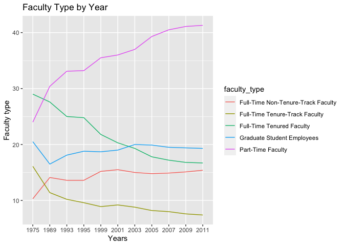
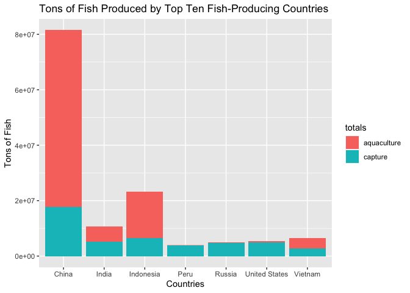

Lab 06 - Ugly charts and Simpson’s paradox
================
Lindsay Stall
1/31/23

### Load packages and data

``` r
library(tidyverse) 
library(dsbox)
library(mosaicData) 
```

``` r
library(usethis)
use_git_config(user.name = "Lindsay Stall", 
               user.email = "stallm21@wfu.edu")
```

``` r
staff <- read_csv("data/instructional-staff.csv")
```

    ## Rows: 5 Columns: 12
    ## ── Column specification ────────────────────────────────────────────────────────
    ## Delimiter: ","
    ## chr  (1): faculty_type
    ## dbl (11): 1975, 1989, 1993, 1995, 1999, 2001, 2003, 2005, 2007, 2009, 2011
    ## 
    ## ℹ Use `spec()` to retrieve the full column specification for this data.
    ## ℹ Specify the column types or set `show_col_types = FALSE` to quiet this message.

``` r
staff_long <- staff %>%
  pivot_longer(cols = -faculty_type, names_to = "year") %>%
  mutate(value = as.numeric(value))
```

``` r
staff_long
```

    ## # A tibble: 55 × 3
    ##    faculty_type              year  value
    ##    <chr>                     <chr> <dbl>
    ##  1 Full-Time Tenured Faculty 1975   29  
    ##  2 Full-Time Tenured Faculty 1989   27.6
    ##  3 Full-Time Tenured Faculty 1993   25  
    ##  4 Full-Time Tenured Faculty 1995   24.8
    ##  5 Full-Time Tenured Faculty 1999   21.8
    ##  6 Full-Time Tenured Faculty 2001   20.3
    ##  7 Full-Time Tenured Faculty 2003   19.3
    ##  8 Full-Time Tenured Faculty 2005   17.8
    ##  9 Full-Time Tenured Faculty 2007   17.2
    ## 10 Full-Time Tenured Faculty 2009   16.8
    ## # … with 45 more rows

### Exercise 1

``` r
staff_long %>%
  ggplot(aes(x = year,
             y = value,
             group = faculty_type,
             color = faculty_type,)) +
  labs(
    x = "Years",
    y = "Faculty type",
    title = "Faculty Type by Year"
  ) +
  geom_line()
```

<!-- -->

### Exercise 2

I would create 2 groups: one for part-time and one for full time to make
the rates of employment between the groups easier to compare.

### Exercise 3

``` r
fisheries <- read_csv("data/fisheries.csv")
```

    ## Rows: 216 Columns: 4
    ## ── Column specification ────────────────────────────────────────────────────────
    ## Delimiter: ","
    ## chr (1): country
    ## dbl (3): capture, aquaculture, total
    ## 
    ## ℹ Use `spec()` to retrieve the full column specification for this data.
    ## ℹ Specify the column types or set `show_col_types = FALSE` to quiet this message.

``` r
fisheries_long <- fisheries %>%
  pivot_longer(cols = -country, names_to = "totals") %>%
  filter(totals %in% c("capture", "aquaculture")) %>%
  mutate(value = as.numeric(value))
```

``` r
fisheries_long %>%
  filter(country %in% c("China", "Indonesia", "India", "United States", "Russia", "Peru", "Vietnam")) %>%
  ggplot(aes(fill = totals, y=value, x=country)) +
  labs(
    x = "Countries",
    y = "Tons of Fish",
    title = "Tons of Fish Produced by Top Ten Fish-Producing Countries"
  ) +
  geom_bar(position="stack", stat="identity")
```

<!-- -->

### Exercise 3

### Exercise 3

### Exercise 3

### Exercise 3

### Exercise 3

### Exercise 3

### Exercise 3
