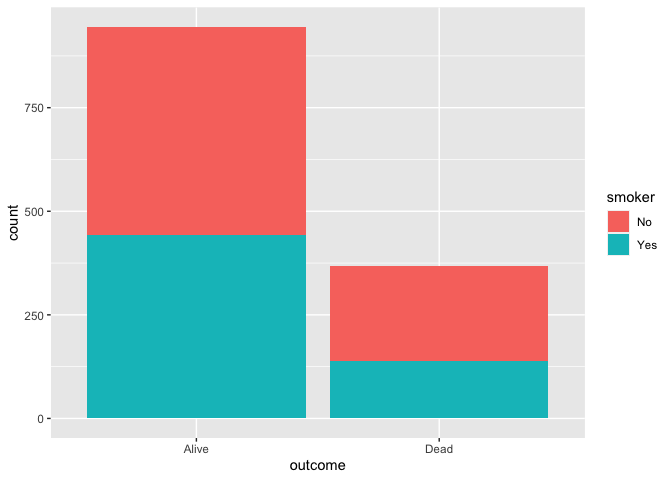
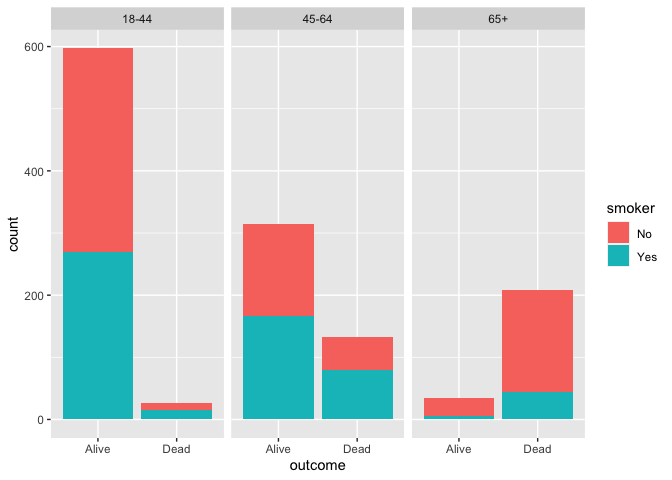

Lab 06 - Ugly charts and Simpson’s paradox
================
Lindsay Stall
1/31/23

### Load packages and data

``` r
library(tidyverse) 
library(dsbox)
library(mosaicData) 
```

``` r
library(usethis)
use_git_config(user.name = "Lindsay Stall", 
               user.email = "stallm21@wfu.edu")
```

``` r
staff <- read_csv("data/instructional-staff.csv")
```

    ## Rows: 5 Columns: 12
    ## ── Column specification ────────────────────────────────────────────────────────
    ## Delimiter: ","
    ## chr  (1): faculty_type
    ## dbl (11): 1975, 1989, 1993, 1995, 1999, 2001, 2003, 2005, 2007, 2009, 2011
    ## 
    ## ℹ Use `spec()` to retrieve the full column specification for this data.
    ## ℹ Specify the column types or set `show_col_types = FALSE` to quiet this message.

``` r
staff_long <- staff %>%
  pivot_longer(cols = -faculty_type, names_to = "year") %>%
  mutate(value = as.numeric(value))
```

``` r
staff_long
```

    ## # A tibble: 55 × 3
    ##    faculty_type              year  value
    ##    <chr>                     <chr> <dbl>
    ##  1 Full-Time Tenured Faculty 1975   29  
    ##  2 Full-Time Tenured Faculty 1989   27.6
    ##  3 Full-Time Tenured Faculty 1993   25  
    ##  4 Full-Time Tenured Faculty 1995   24.8
    ##  5 Full-Time Tenured Faculty 1999   21.8
    ##  6 Full-Time Tenured Faculty 2001   20.3
    ##  7 Full-Time Tenured Faculty 2003   19.3
    ##  8 Full-Time Tenured Faculty 2005   17.8
    ##  9 Full-Time Tenured Faculty 2007   17.2
    ## 10 Full-Time Tenured Faculty 2009   16.8
    ## # … with 45 more rows

### Exercise 1

``` r
staff_long %>%
  ggplot(aes(x = year,
             y = value,
             group = faculty_type,
             color = faculty_type,)) +
  labs(
    x = "Years",
    y = "Faculty type",
    title = "Faculty Type by Year"
  ) +
  geom_line()
```

<!-- -->

### Exercise 2

I would create 2 groups: one for part-time and one for full time to make
the rates of employment between the groups easier to compare.

### Exercise 3

``` r
fisheries <- read_csv("data/fisheries.csv")
```

    ## Rows: 216 Columns: 4
    ## ── Column specification ────────────────────────────────────────────────────────
    ## Delimiter: ","
    ## chr (1): country
    ## dbl (3): capture, aquaculture, total
    ## 
    ## ℹ Use `spec()` to retrieve the full column specification for this data.
    ## ℹ Specify the column types or set `show_col_types = FALSE` to quiet this message.

``` r
fisheries_long <- fisheries %>%
  pivot_longer(cols = -country, names_to = "totals") %>%
  filter(totals %in% c("capture", "aquaculture")) %>%
  mutate(value = as.numeric(value))
```

``` r
fisheries_long %>%
  filter(country %in% c("China", "Indonesia", "India", "United States", "Russia", "Peru", "Vietnam")) %>%
  ggplot(aes(fill = totals, y=value, x=country)) +
  labs(
    x = "Countries",
    y = "Tons of Fish",
    title = "Tons of Fish Produced by Top Ten Fish-Producing Countries"
  ) +
  geom_bar(position="stack", stat="identity")
```

<!-- -->

### Exercise 3

``` r
library(tidyverse) 
library(mosaicData) 
```

``` r
data(Whickham)
```

``` r
?Whickham
```

``` r
view(Whickham)
```

What type of study do you think these data come from: observational or
experiment? Why? Observational because it is a survey and the outcomes
were dead and alive.

How many observations are in this dataset? What does each observation
represent? 1314 observation

How many variables are in this dataset? What type of variable is each?
Display each variable using an appropriate visualization. 3 variables:
outcome survival status after 20 years: a factor with levels Alive Dead
smoker smoking status at baseline: a factor with levels No Yes age age
(in years) at the time of the first survey

What would you expect the relationship between smoking status and health
outcome to be? “Yes” status would lead to greater “dead” outcomes (esp
at younger ages)

### Exercise 3

``` r
Whickham %>%
  count(smoker, outcome)
```

    ##   smoker outcome   n
    ## 1     No   Alive 502
    ## 2     No    Dead 230
    ## 3    Yes   Alive 443
    ## 4    Yes    Dead 139

``` r
ggplot(Whickham, aes(fill = smoker, x = outcome))+
geom_bar()
```

<!-- --> 68% of Non
smokers are alive 76% of smokers are alive This was not what I expected.

### Exercise 3

``` r
Whickham <- Whickham %>%
  mutate(age_cat = case_when(
    age <= 44 ~ "18-44",
    age > 44 & age <= 64 ~ "45-64",
    age > 64 ~ "65+"
))
```

``` r
Whickham %>%
  count(smoker, age_cat, outcome)
```

    ##    smoker age_cat outcome   n
    ## 1      No   18-44   Alive 327
    ## 2      No   18-44    Dead  12
    ## 3      No   45-64   Alive 147
    ## 4      No   45-64    Dead  53
    ## 5      No     65+   Alive  28
    ## 6      No     65+    Dead 165
    ## 7     Yes   18-44   Alive 270
    ## 8     Yes   18-44    Dead  15
    ## 9     Yes   45-64   Alive 167
    ## 10    Yes   45-64    Dead  80
    ## 11    Yes     65+   Alive   6
    ## 12    Yes     65+    Dead  44

``` r
ggplot(Whickham, aes(fill = smoker, x = outcome))+
facet_wrap(~age_cat)+geom_bar()
```

<!-- -->
